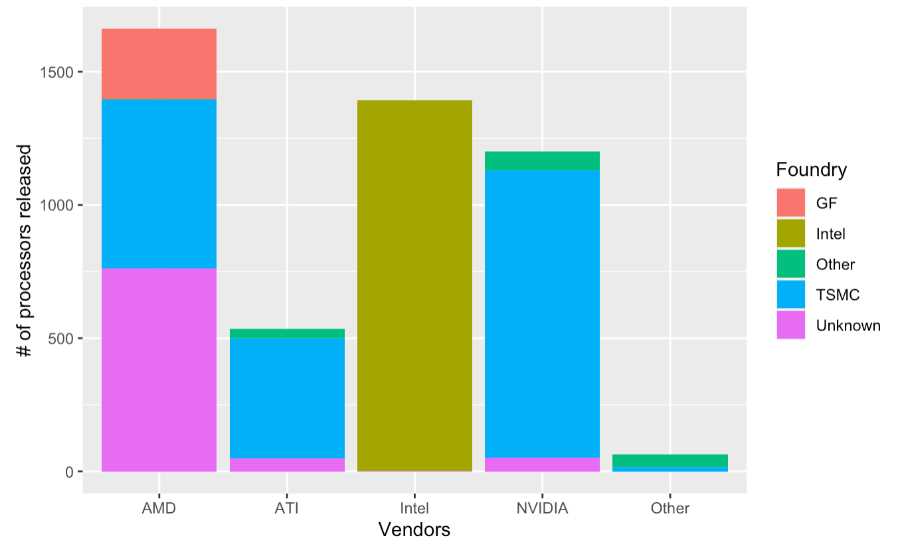
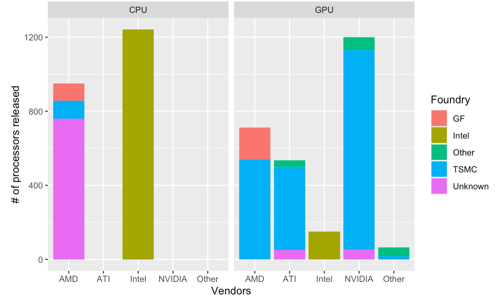
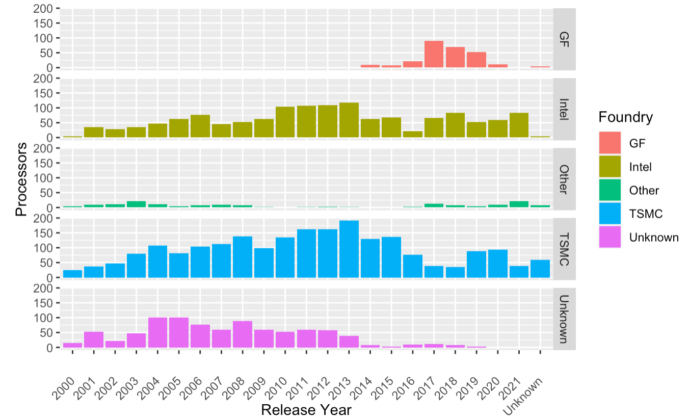
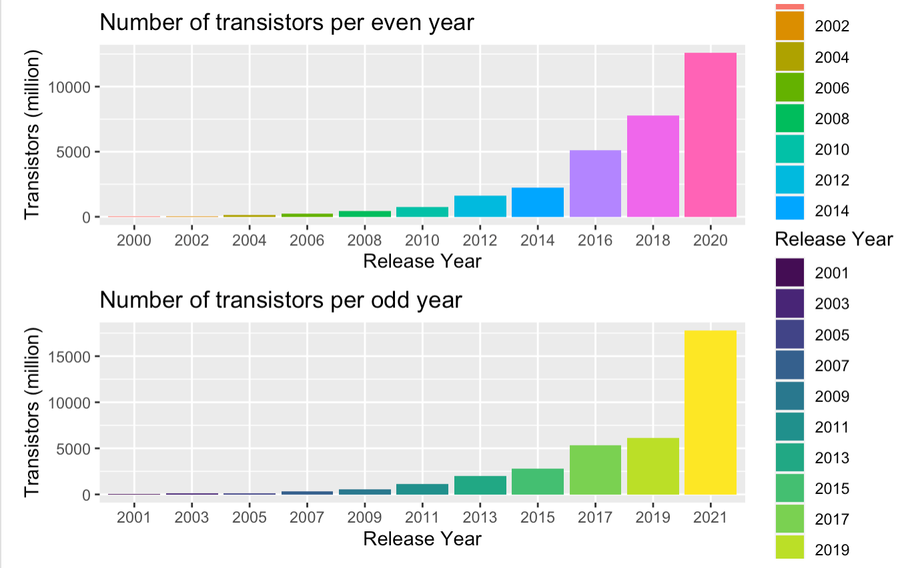

# CPU and GPU Design Trends Analysis

## OBJECTIVES
- Analyzed vendor and foundry relationships in processor production
- Investigated the association between die size and thermal design power and assessed Moore's Law prediction

## RESULTS FOUND
#### Vendor and foundry relationships in processor production
There isn't a strong association between the number of processors released by the vendors and the foundries. For all vendors, the composition of their foundries is mixed. For example, the processors sold by AMD come from unknown foundries, TSMC, and GF. This case applies to all vendors. For Intel, although only two processors are produced by foundries other than itself, we still can't say they are exclusively released by Intel. The lack of association does not depend on the processor type; neither the CPU nor GPU data demonstrate a clear pattern of association. Each vendor's suppliers are different foundries, and they produce in different portions.

  

  

#### Die size and thermal design power relationships
Numerically, the association between die size and thermal design for GPU is stronger than CPU's (0.73>0.41). Meanwhile, GPU's regression line in the plot is steeper than CPU's. Thus, the association between die size and thermal design power does depend on the type.

  

#### Total number of processors produced by foundries and vendors comparison
For foundries, TSMC, Intel, and unknown foundries have been the leading producers of processors through the years. All foundries experienced a steady increase and a gradual decrease from 2000 - 2021. Only Intel was able to maintain its normal level of production throughout the years.

  

For vendors, the trend is similar to the trend for foundries. AMD, Intel, NVIDIA, and ATI are the top vendors of the processors. However, ATI stopped selling the processors in 2014. AMD, Intel, and NVIDIA all experienced a gradual increase from 2000 - 2012 and a decrease from 2013 - 2021.

  

#### Moore's Law prediction assessment
In order to avoid generalization, we inspected the trend for both odd years and even years. Since the number of transistors is too small to visualize in the graphs before 2012, the data frame shows that for even years, transistor numbers in microchips doubled for some biennial years but did not double for some as well. It is easier to tell this fact from the bar graph from 2012 onward. For the odd years, this is more clear both numerically and graphically that the number of transistors contained did not double. Therefore, despite the general increasing trend, the number of transistors did not double every two years. 

  

